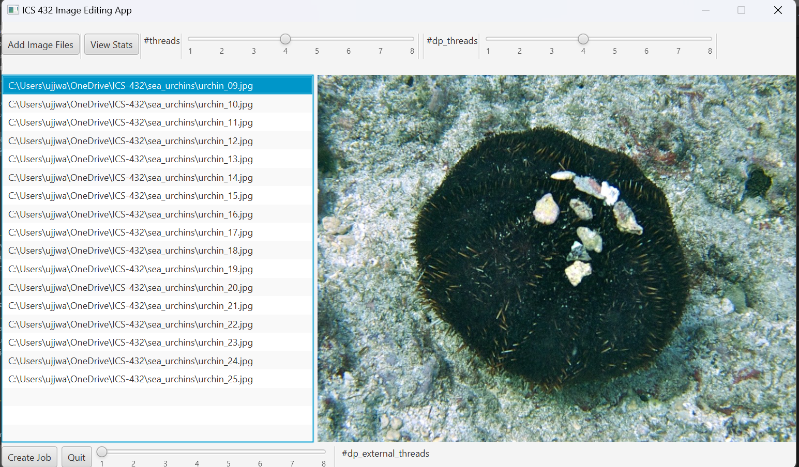
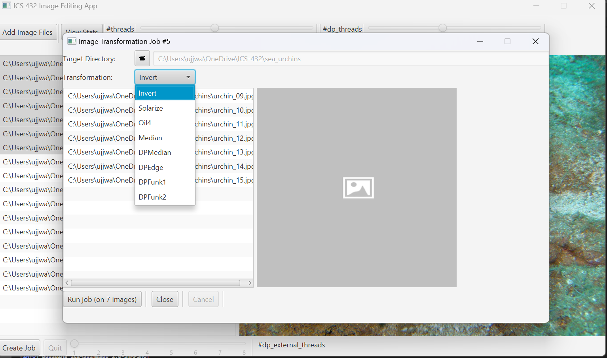
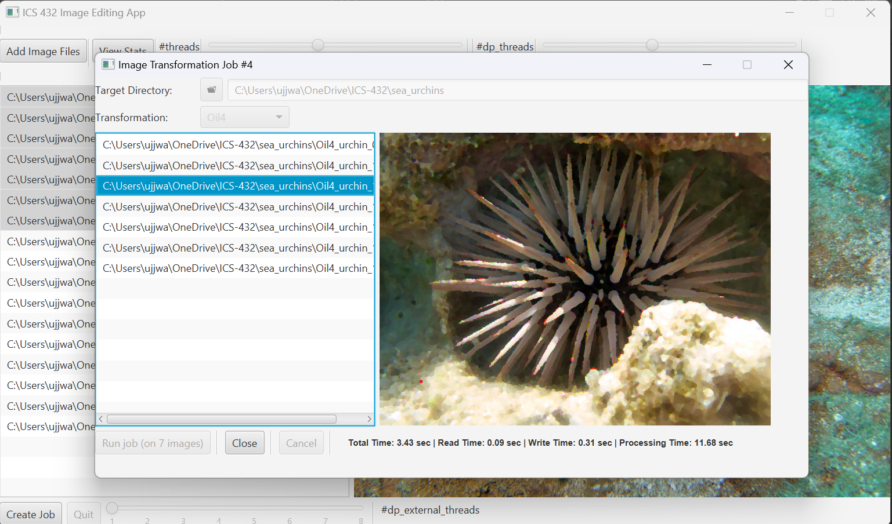

# Image Filter App Usage Instructions

1. **Select the images** you want to process and choose the desired number of threads using the slider.

   - The "**#threads**" label determines the number of processing threads for the Invert, Solarize, Oil4, and Median Filter operations. Increasing the number of threads will speed up the processing time, as the application employs task parallelization.

   - The "**#dp_threads**" label sets the number of processing threads for the custom-built DPMedian filter. These threads utilize data parallelization, which improves the processing speed of the DPMedian Filter.

   - The "**#dp_external_threads**" label chooses the number of threads and passes them as an argument to be used in the OpenMP parallelization in an external C program running inside a Docker container.

   

2. **Select the destination directory** where you want to save the filtered images.
    

   **Choose the desired filter** from the dropdown menu and click the "Run" button to start the job.

   

3. Once the job is complete, the application will **display the processing statistics**. Observe the time it takes to complete the job with different numbers of threads to understand the impact of multithreading on performance.

